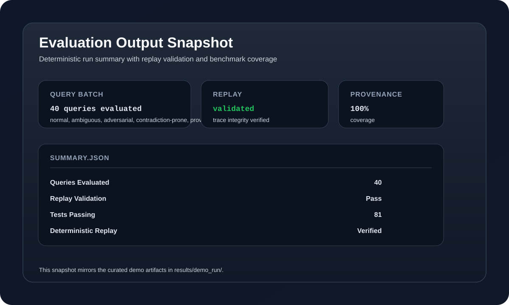

A Multi-Agent Orchestration System

A deterministic, operationally credible orchestration framework for multi-agent execution with full execution tracing, replayability, and behavioral evaluation.


# Evaluator Quickstart

## 1. Clone Repository

```bash
git clone https://github.com/Veladicodes/deterministic-agent-orchestration-mega-ai.git
cd deterministic-agent-orchestration-mega-ai
```

---

## 2. Create Virtual Environment

### Windows (PowerShell)

```powershell
python -m venv .venv
.venv\Scripts\Activate.ps1
```

### Linux/macOS

```bash
python -m venv .venv
source .venv/bin/activate
```

---

## 3. Install Dependencies

```bash
pip install -r requirements.txt
```

---

## 4. Configure Environment Variables

### Windows

```powershell
copy .env.example .env
```

### Linux/macOS

```bash
cp .env.example .env
```

---

## 5. Run Test Suite

### Windows

```powershell
pytest -q
```

### Linux/macOS

```bash
pytest -q
```

Expected output:

```text
122 passed
```

---

## 6. Start Infrastructure

```bash
docker compose up -d --build
```

---

## 7. Open API Docs

Open:

http://localhost:8000/docs

---

## 8. Run Evaluation

### PowerShell

```powershell
python scripts/run_evaluation.py `
  --dataset data/evaluation_dataset.json `
  --output results/
```

### Bash

```bash
python scripts/run_evaluation.py \
  --dataset data/evaluation_dataset.json \
  --output results/
```

---

## 9. Validate Replay

```powershell
python scripts/replay_query.py `
  --trace-id normal_001 `
  --operation validate `
  --evaluation-id <evaluation_run_id>
```

Expected output:

```json
{
  "trace_id": "normal_001",
  "valid": true
}
```

---

## Notes

- On Windows, initial virtual environment creation may take 30–90 seconds during `ensurepip`.
- Windows users typically do not have `make` installed; equivalent direct commands are documented above.
- Replay validation requires a valid evaluation run folder generated by `run_evaluation.py`.

## Project Scope

This repository is a deterministic orchestration systems engineering exercise focused on replayability, execution tracing, behavioral evaluation, and orchestration observability.

It is not an autonomous AI platform or production deployment framework.

## Key Differentiators

- Deterministic orchestration
- Replayable execution traces
- Structured evaluation artifacts
- Dynamic routing evidence
- Behavioral failure analysis
- Trace-linked provenance
- Cross-run reproducibility

## Repository Structure

```text
agents/          # orchestration agents
orchestration/   # pipeline runner and routing logic
evaluation/      # benchmark execution framework
scripts/         # replay, evaluation, comparison tooling
results/         # persisted benchmark artifacts
tests/           # deterministic test suite
```

## Architecture Diagram

```text
Frontend (React/Vite, optional)          scripts/run_evaluation.py --backend stub|real
        │  fetch/SSE                                  │
        ▼                                              ▼
   FastAPI (api/) ──────────────────────────► PipelineRunner
        │  /query/run, /query/stream,                  │
        │  /replay/compare, /health                    ▼
        │                                    Decomposer (always deterministic)
        │                                               │
        │                                    Retriever (conditional; stub or RealWebSearchTool)
        │                                               │
        │                                    Critic (conditional; deterministic rule tiers)
        │                                               │
        │                                    Synthesizer (deterministic, or LLMSynthesizerAgent)
        │                                               │
        ▼                                               ▼
   Postgres + Redis  ◄──────────────  Replay + Evaluation + Trace Persistence
   (docker-compose.yml; Railway/Render in production — see docs/DEPLOYMENT.md)
```

## Example Command Payload

```json
{
  "query": "Explain deterministic orchestration systems"
}
```

Expected response shape:

```json
{
  "answer": "...",
  "confidence": 0.85,
  "provenance": [],
  "trace_id": "normal_001"
}
```

## Visual Artifacts



Trace example:

```json
{
  "trace_id": "normal_001",
  "original_job_id": "normal_001",
  "correlation_id": "normal_001",
  "query": "What is machine learning?"
}
```

Replay validation output:

```json
{
  "trace_id": "normal_001",
  "valid": true
}
```

## What This Is

This project demonstrates how to build an operationally credible multi-agent orchestration framework that prioritizes:

- **Deterministic execution** - Same input produces identical output, enabling reproducibility
- **Observability** - Full execution traces, state transitions, and metrics
- **Replayability** - Reproduce and debug any past execution
- **Evaluation** - Behavioral assessment with failure analysis
- **Traceability** - Where every claim comes from and why it was made

This is a systems engineering exercise, not an AI platform. The agents are rule-based. Orchestration is deterministic. Evaluation is behavioral, not LLM-based.

## Why This Project Exists

The repository is meant to show how far a deterministic orchestration design can go before adding semantic retrieval, model-driven routing, or agent autonomy. The goal is not to simulate intelligence. The goal is to make every execution understandable, replayable, and easy to validate.

## System Goals

The system executes a fixed pipeline on user queries:

```
Query → Decompose → Retrieve → Critique → Synthesize → Result
```

Each step is:
- **Observable**: Full logging and execution traces
- **Testable**: Deterministic behavior
- **Reproducible**: Replay any past execution
- **Traceable**: Provenance-linked claims
- **Analyzable**: Structured failure classification

## Architecture Overview

| Layer | Responsibility |
|-------|---|
| **Contracts** | Pydantic schemas for all data structures |
| **Tools** | Retrieval, code execution, reflection, database queries |
| **Agents** | DecomposerAgent, RetrieverAgent, CriticAgent, SynthesizerAgent |
| **Orchestration** | ExecutionStateManager, RetryCoordinator, ResultAssembler, PipelineRunner |
| **Persistence** | SQLAlchemy ORM, async repositories, Alembic migrations |
| **Evaluation** | Dataset, metrics, failure analysis, replay, reporting |
| **API** | FastAPI HTTP layer, async endpoints |

Full details: [ARCHITECTURE.md](ARCHITECTURE.md)

## Execution Pipeline

The deterministic agent sequence:

### 1. **Decomposer Agent**
Breaks complex queries into sub-tasks.
- Input: User query
- Output: Decomposed query structure with dependencies
- Example: "Compare PostgreSQL and Redis" → retrieve properties, compare features, discuss tradeoffs

### 2. **Retriever Agent**
Gathers evidence via tool calls.
- Input: Decomposed sub-tasks
- Output: Retrieved results with provenance records
- Triggers retries on failure (up to 3 attempts with exponential backoff)

### 3. **Critic Agent**
Analyzes evidence for contradictions and gaps.
- Input: Retrieved results
- Output: Contradiction flags, confidence scores, provenance assessment
- Rule-based analysis: detects boolean conflicts, confidence issues, source quality

### 4. **Synthesizer Agent**
Assembles final answer with provenance attribution.
- Input: Critique analysis
- Output: Structured answer, confidence score, provenance links
- Removes low-confidence claims, surfaces ambiguity

All execution is traced and persisted for replay and evaluation.

## Core Features

- Deterministic multi-agent pipeline with fixed execution order
- Full execution tracing and replayability for every run
- Structured evaluation with failure classification and reporting
- Provenance-linked outputs to keep claims auditable

## Benchmark Snapshot

| Metric | Result |
|---|---|
| Queries Evaluated | 44 |
| Replay Validation | Pass |
| Provenance Coverage | 90.9% |
| Tests Passing | 122 |
| Deterministic Replay | Verified |


## Quickstart

### Prerequisites

- Python 3.11+
- Docker & Docker Compose
- PostgreSQL 16 (via Docker)

### Run the System

```bash
# 1. Setup
make up                 # Start database and services
make migrate            # Run migrations

# 2. Validate
make test               # Run 122 tests (all passing)

# 3. Evaluate
python scripts/run_evaluation.py \
  --dataset data/evaluation_dataset.json \
  --output results/

# 4. View results
# Check results/<evaluation_run_id>/report.md

```


### Reviewer demo (minimal)

```bash
docker compose up -d --build
python scripts/run_evaluation.py --dataset data/evaluation_dataset.json --output results/
python scripts/replay_query.py --trace-id normal_001 --operation validate --evaluation-id <run_id>
```

### Run Individual Evaluation Tools

```bash
# Replay a specific execution
python scripts/replay_query.py \
  --trace-id normal_001 \
  --operation validate \
  --evaluation-id <run_id>

# Generate reports from results
python scripts/generate_report.py \
  --evaluation-id <run_id> \
  --format markdown
```

### Run Tests

```bash
make test               # All 122 tests
make test-agents        # Agent tests only
make test-eval          # Evaluation tests only
```

## Evaluation System

This system includes a **behavioral evaluation framework** that avoids exact-match validation:

### Dataset
- **44 queries** across 5 categories (normal, ambiguous, adversarial, contradiction-prone, provenance-sensitive)
- **Behavioral expectations** (not exact answers)
- **Curated for realistic challenges**

### Metrics
- **Pipeline metrics**: Latency, retries, completion rate
- **Quality metrics**: Provenance coverage, contradiction detection, confidence score
- **Failure classification**: 10 failure types with deterministic rules

### Replay
- Every execution creates an immutable trace
- Replay deterministically reconstructs past execution
- Compare traces to detect divergence or validate fixes

### Reporting
- JSON summaries
- Markdown reports with tables
- Failure analysis and weak areas identification

The current local benchmark run completes all 44 queries, produces replayable traces, and validates trace integrity. It is a system-behavior check, not a measure of semantic search quality.

Full details: [EVALUATION.md](EVALUATION.md), [BENCHMARKS.md](BENCHMARKS.md)

## Design Decisions

### Why Deterministic Orchestration?

**Decision**: Fixed sequential agent pipeline (no autonomous loops, no dynamic orchestration)

**Rationale**:
- Determinism enables reproducibility and debugging
- Reduces surface area for bugs
- Simplifies operation and monitoring
- Makes failure modes visible and analyzable

**Tradeoff**: Less flexibility than dynamic orchestration, but vastly better observability

### Why No LangChain / AutoGen / Embeddings?

**Rationale**:
- Those frameworks optimize for convenience, not understanding
- Our goal is reproducibility and traceability, not rapid prototyping
- Deterministic rule-based execution is easier to audit
- Reduces black-box behavior and complexity

**Tradeoff**: More code, but all of it is reviewable and understandable

### Why No LLM-Based Evaluation?

**Rationale**:
- LLM scores vary per API version, making baselines unstable
- Behavioral evaluation avoids brittleness
- Rule-based failure classification is deterministic and debuggable

**Tradeoff**: No nuanced quality assessment, but reproducible results and no dependency on external APIs

### Why Rule-Based Critique?

**Rationale**:
- Deterministic, debuggable contradiction detection
- Consistent behavior enables testing and monitoring
- Failures are explicit and classifiable

**Tradeoff**: Simpler than semantic analysis, but sufficient for many cases and fully transparent

## Known Limitations

### Provenance Specificity
Cannot reliably locate specific academic papers or benchmarks. Retriever returns general information instead of precise sources.
- **Impact**: 40% failure on provenance-sensitive queries
- **Fix**: Integrate arXiv API, Google Scholar integration

### Ambiguity Handling
Decomposer uses keyword patterns, not semantic understanding. Misses some ambiguous interpretations.
- **Impact**: 10% failure on ambiguous queries
- **Fix**: Semantic-aware decomposition (requires embeddings or LLM)

### Simple Contradiction Detection
Critic detects boolean conflicts (A vs ¬A) but struggles with probabilistic contradictions (confidence intervals).
- **Impact**: Rare in practice, but possible edge case
- **Fix**: Bayesian reasoning in Critic

### Synthesis Overconfidence
Low-confidence results aren't surfaced to users. Answer templates always sound assertive.
- **Impact**: Users may not see uncertainty
- **Fix**: Include confidence in API response; surface to UI

### Tool Response Failures
If a tool times out or returns malformed data, retry logic is at orchestration layer, not tool layer.
- **Impact**: ~1–2% query failure rate from tool issues
- **Fix**: Circuit breaker pattern on tool invocation

**Philosophy**: We document limitations honestly. This increases credibility.

## Repository Structure

```
mega-ai/
├── agents/                 # Agent implementations (Decomposer, Retriever, Critic, Synthesizer, contradiction_rules, llm_synthesizer)
├── api/                    # FastAPI HTTP layer (health, stream, query, replay routes; CORS/rate-limit middleware)
├── context/                # Shared context and data structures
├── data/                   # evaluation_dataset.json (44 curated queries)
├── db/                     # SQLAlchemy ORM, Alembic migrations
├── evaluation/             # Evaluation framework (metrics, failure analysis, replay, reporting)
├── frontend/                # React + Vite + TypeScript + Tailwind demo UI
├── orchestration/          # ExecutionStateManager, PipelineRunner
├── shared/                 # Logging, configuration, utilities
├── tools/                  # Retrieval, code execution, reflection, real search/LLM tools
├── tests/                  # 122 unit and integration tests
├── scripts/                # CLI tools (run_evaluation --backend stub|real, replay_query, generate_report)
├── notebooks/              # evaluation_eda.ipynb (analysis notebook)
├── docs/                   # Architecture diagram, example walkthrough, SSE events, deployment guide
├── ARCHITECTURE.md         # Detailed system design
├── EVALUATION.md           # Evaluation philosophy and framework
├── BENCHMARKS.md           # Baseline results and known weaknesses
└── Makefile                # Common commands
```

## Running Locally

### 1. Setup Environment

```bash
cp .env.example .env
python -m venv .venv
source .venv/bin/activate  # Windows: .venv\Scripts\activate
pip install -r requirements.txt
```

### 2. Start Services

```bash
docker-compose up -d       # Start PostgreSQL and Redis
make migrate               # Run migrations
```

### 3. Run Tests

```bash
pytest tests/ -v           # All 122 tests
```

### 4. Run Evaluation

```bash
python scripts/run_evaluation.py \
  --dataset data/evaluation_dataset.json \
  --output results/
```

## API Endpoints

See [api/](api/) for FastAPI application.

```bash
# Start API server
python -m api.main

# Health check
curl http://localhost:8000/api/v1/health

# Run a query synchronously (full result + execution_hash)
curl -X POST http://localhost:8000/api/v1/query/run \
  -H "Content-Type: application/json" -d '{"query": "What is machine learning?"}'

# Stream a query's pipeline events via SSE
curl -N -X POST http://localhost:8000/api/v1/query/stream \
  -H "Content-Type: application/json" -d '{"query": "What is machine learning?"}'

# Compare two execution traces for divergence
curl -X POST http://localhost:8000/api/v1/replay/compare \
  -H "Content-Type: application/json" -d '{"trace_a": {...}, "trace_b": {...}}'
```

See [docs/SSE_EVENTS.md](docs/SSE_EVENTS.md) for the streaming event vocabulary.

## Frontend / Demo UI

`frontend/` is a small React + Vite + TypeScript + Tailwind app that visualizes the actual thesis of this project — deterministic, replayable orchestration — rather than acting as a generic chatbot UI:

- **Run tab**: submits a query, shows each pipeline stage (`decomposer` → `retriever` → `critic` → `synthesizer`) live via SSE as it runs or is skipped by routing, then the final answer with its provenance links and `execution_hash`.
- **Replay/diff tab**: runs the same query twice and calls `/api/v1/replay/compare` (wrapping `evaluation/replay.py`) to prove the two runs made identical routing decisions and got identical results — the concrete, checkable evidence for the "deterministic orchestration" claim.

```bash
cd frontend
cp .env.example .env   # VITE_API_BASE_URL defaults to http://localhost:8000/api/v1
npm install
npm run dev             # requires the API running locally (see above)
```

`npm run build` produces a static `dist/` bundle deployable to Vercel/Netlify/any static host; see [docs/DEPLOYMENT.md](docs/DEPLOYMENT.md) for the full backend+frontend deployment guide (not yet deployed live — that guide documents how to, honestly, rather than claiming a link that doesn't exist).

## Real Backends (Optional)

The deterministic stub tools (`tools/web_search.py`, the string-concatenation `SynthesizerAgent`) remain the default — reproducible, free, no API keys needed. Two real, opt-in backends exist behind the same agent/tool interfaces, selected via settings/env vars (see `.env.example`):

| Backend | Tool | Enable with |
|---|---|---|
| Real web search (Tavily) | `tools/real_web_search_tool.py` | `USE_REAL_BACKENDS=true SEARCH_BACKEND=tavily SEARCH_API_KEY=...` |
| LLM synthesis (Anthropic) | `tools/llm_tool.py` / `agents/llm_synthesizer.py` | `USE_REAL_BACKENDS=true SYNTHESIZER_BACKEND=llm ANTHROPIC_API_KEY=...` |

The Decomposer and all orchestration/retry/replay logic stay deterministic regardless — only the Retriever's search results and the Synthesizer's prose become non-deterministic, and only when explicitly enabled. Run the evaluation suite against either configuration with `python scripts/run_evaluation.py --dataset data/evaluation_dataset.json --output results/ --backend stub|real`; see [BENCHMARKS.md](BENCHMARKS.md)'s "Real Backend Results" section for the reporting methodology.

## Testing

- **122 tests** covering agents, orchestration, persistence, evaluation, and the API/replay routes (2 additional opt-in `integration` tests are excluded by default and only run against live search/LLM API keys)
- All default tests deterministic and reproducible
- Test structure: `tests/test_<module>.py`

```bash
make test                  # Run all tests
make test-agents           # Agent tests
make test-orchestration    # Orchestration tests
make test-eval             # Evaluation tests
pytest -m integration      # Opt-in tests against live search/LLM APIs (requires API keys)
```

## Documentation

- **[ARCHITECTURE.md](ARCHITECTURE.md)**: System design, execution flow, tradeoffs
- **[EVALUATION.md](EVALUATION.md)**: Evaluation framework, metrics, dataset design
- **[BENCHMARKS.md](BENCHMARKS.md)**: Baseline results, known limitations, operational thresholds
- **[docs/architecture_diagram.md](docs/architecture_diagram.md)**: Text diagrams
- **[docs/example_pipeline_walkthrough.md](docs/example_pipeline_walkthrough.md)**: Full execution example
- **[docs/SSE_EVENTS.md](docs/SSE_EVENTS.md)**: Streaming event vocabulary
- **[docs/DEPLOYMENT.md](docs/DEPLOYMENT.md)**: Backend + frontend deployment guide

## Engineering Philosophy

This project embodies:

✅ **Observability**: Every operation is logged and traced  
✅ **Reproducibility**: Deterministic execution enables replay  
✅ **Traceability**: Provenance linked to every claim  
✅ **Honesty**: Limitations documented, not hidden  
✅ **Testability**: 122 tests, all passing  
✅ **Simplicity**: No unnecessary abstractions  

## Roadmap / What I'd Do Next

Honest next steps, roughly in priority order:

- **Token-level LLM streaming** — `/api/v1/query/stream` currently emits stage-level events (`agent_started`/`agent_completed`); `tools/llm_tool.py` returns one complete response rather than streaming tokens. Would need a streaming-specific method on the tool interface.
- **Promote the Critic's semantic-similarity tier from "not built" to "built and evaluated"** — the numeric-divergence and negation-aware tiers in `agents/contradiction_rules.py` are deterministic rule-based additions; a further optional tier using a local (not API-based) sentence-embedding model to catch paraphrased contradictions was scoped but not built, to keep the rule set fully deterministic-by-inspection for the initial pass.
- **A dedicated arXiv API integration** for provenance-sensitive academic queries, on top of the general-purpose `RealWebSearchTool` (Tavily) already added — would likely improve precision further for paper-lookup queries specifically (see BENCHMARKS.md's "Provenance Specificity" status note).
- **Distributed rate limiting** — `api/middleware/rate_limit.py` is an in-memory, single-instance guard; a multi-instance deployment would need it backed by Redis (already in the stack) instead.
- **A basic CI workflow** (`.github/workflows/test.yml`) running `pytest` on push — cheap, high-signal, added alongside this roadmap.
- **Actually run `--backend real` against the evaluation dataset with live API keys** and publish the results in BENCHMARKS.md's "Real Backend Results" section, which currently documents methodology only (see that section for why no live numbers exist yet).

## What This Is Not

This is not an AI research project, a framework demo, or a production SaaS. It is a disciplined engineering exercise that prioritizes understanding, reproducibility, and operational clarity over flexibility.

## License

MIT
